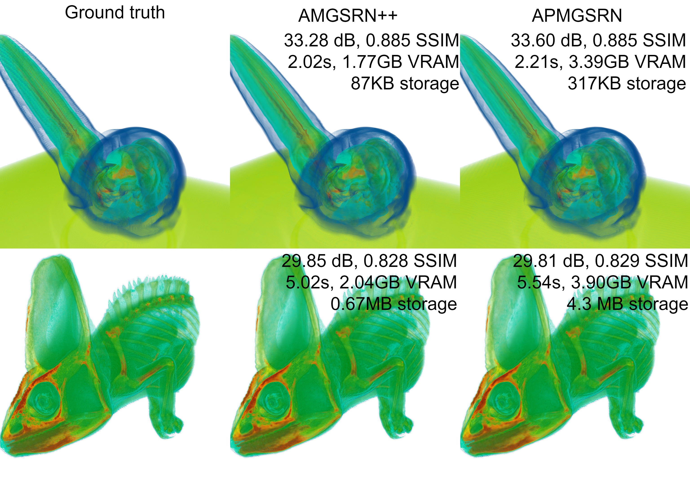

# AMGSRN++ - Advanced Adaptive Multi-Grid Scene Representation Networks



AMGSRN++ builds upon and improves the [APMGSRN](https://github.com/skywolf829/APMGSRN) architecture with CUDA kernels, compression aware training, feature grid compression, and time-varying support.
The CUDA kernels are implemented in another repository: [AMG_Encoder](https://github.com/skywolf829/AMG_Encoder).

## Requirements
- CUDA-enabled GPU
- CUDA [12.4](https://developer.nvidia.com/cuda-12-4-0-download-archive) or [11.8](https://developer.nvidia.com/cuda-11-8-0-download-archive)
- [conda](https://docs.anaconda.com/miniconda/miniconda-install/)
- (Optional) [SZ3](https://github.com/szcompressor/SZ3) for feature grid compression

## Platform Support
- ✅ Windows
- ✅ WSL2
- ✅ Linux
- ❌ MacOS (not supported)

## Installation
1. Install CUDA 12.4 from NVIDIA's website
2. Set up the environment:
```
conda create -n amgsrn python=3.11
conda activate amgsrn
pip install torch torchvision torchaudio --index-url https://download.pytorch.org/whl/cu124
pip install -e . --extra-index-url https://download.pytorch.org/whl/cu124
```
3. (Optional) Install TinyCudaNN for faster training:
```
pip install "tiny-cuda-nn @ git+https://github.com/NVlabs/tiny-cuda-nn/#subdirectory=bindings/torch"
```
Note: On Windows, execute this in x64 Native Tools Command Prompt for VS in administrator mode.

## Usage Examples
Jobs are configured in JSON documents in the `AMGSRN/BatchRunSettings` folder. See there for examples.

### Training
```
python AMGSRN/start_jobs.py --settings train.json
```
### Testing
```
python AMGSRN/start_jobs.py --settings test.json
```
### Renderer
The renderer provides an interactive visualization interface with the following features:
- Real-time volume rendering
- Transfer function editing
- Multiple colormap support
- Adjustable batch size and sampling rate
- Performance statistics
- Image export capabilities

For detailed renderer usage, see `AMGSRN/UI/README.md`.

[](https://youtu.be/gesEli7F_JQ)


### Contributing
Contributions are welcome! Please feel free to submit pull requests.

### License
This project is licensed under the MIT License - see the LICENSE file for details.

### Citation
If you use this work in your research, please cite this when the paper is published!

